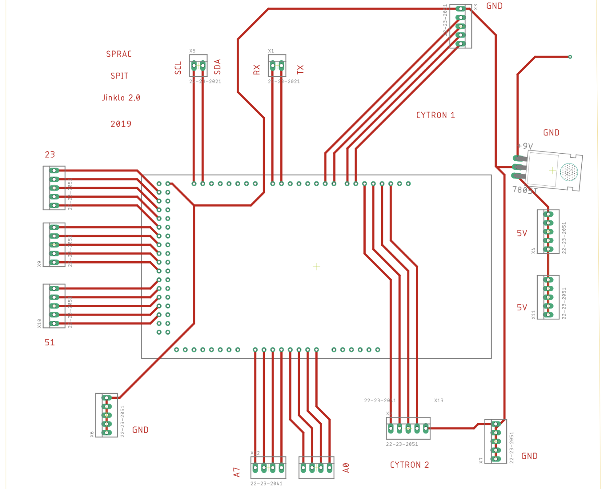

# Mechanum-4-Wheeled
The code explains how to code an Arduino to run a Square Chassis with 4 Mechanum Wheels in all directions.

The system comprises of the following:

  1) Arduino Mega 2560
  2) Mechanum Wheels with an angle of 45 Degrees between the rollers
  3) Cytron Motor Drivers

## PCB Layout

The PCB Layout of the various components and their positioning is attached in the 'SPRAC.pdf'. If you observe, I have made provisioning for +5V and GND for the Motor Driver Pins. 

The Cytron Motor Driver DIR+ and DIR- is responsible for changing the direction of rotation of the motors.

The Layout is shown below:

The PCB makes the provision for all four motors and their respective motor drivers. Also included are the extra +5V and GND pins.

## Contact

If you loved what you read here and feel like we can collaborate to produce some exciting stuff, or if you just want to shoot a question, please feel free to connect with me on [LinkedIn](https://www.linkedin.com/in/vigviswa/)
